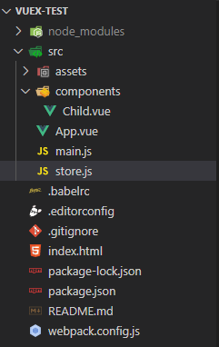
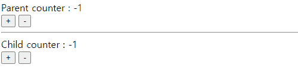

# 💡 vuex 시작하기

## 📝목차


## 1. Vuex와 State
    뷰엑스를 알아보기 위해 버튼으로 숫자를 늘리고 줄일 수 있는 카운터 앱을 통해 
    Vue CLI로 프로젝트를 생성한 다음 아래와 같이 Parent, Child 컴포넌트를 제작한다. 

### 1-1. 간단한 Vue App구성


- vue CLI로 원하는 폴더에 프로젝트를 생성하고, 위와 같이 폴더 구조를 만든다.
  - ```App.vue``` : 상위 컴포넌트(Parent)
  - ```child.vue``` : 하위 컴포넌트(Child)

### 1-2. parent, child 컴포넌트 설정
> App.vue (parent)
```vue
<template>
  <div id="app">
    Parent counter : {{ counter }} <br>
    <button v-on:click = "addCounter">+</button>
    <button v-on:click = "subCounter">-</button>
    <!--  child 컴포넌트를 등록하고 counter 데이터 속성을 props로 전달한다. -->
    <Child v-bind:num = "counter"></Child>
  </div>
</template>

<script>
  // child 컴포넌트 연결
  import Child from './components/Child.vue'

  export default{
    data(){
      return{
        counter: 0
      };
    },
    methods:{
      addCounter(){
        this.counter++;
      },
      subCounter(){
        this.counter--;
      }
    }, 
    components: {
      // child 컴포넌트를 하위 컴포넌트로 등록
      'Child' : Child
    }
  }
</script>
...
```

<br>

> Child.vue (Child)
```vue
<template>
  <div>
    <hr>
    Child counter : {{ num }} <br>
    <button>+</button>
    <button>-</button>
  </div>
</template>

<script>
  // 상위 컴포넌트에서 내려준 counter 속성을 num로 받음
  props: ["num"]
</script>
...
```


- 버튼을 클릭하면 parent와 child컴포넌트가 함께 변동된다.
- 상위 컴포넌트에서 하위 컴포넌트에게 props(counter)를 전달하는 기본적인 컴포넌트 통신 방법을 사용했기 때문이다.
- 하지만 컴포넌트의 갯수가 무한정 많아 진다면, 최상위 컴포넌트에서 맨 아래의 컴포넌트에 데이터를 전달하기 위해 중간 계층 컴포넌트에게 props, event를 선언해줘야한다.
- 효율적인 데이터 관리를 위해 **vuex** 를 이용해보자 


### 1-3. vuex 설치 및 등록
- 해당 프로젝트 폴더 cmd창을 열어서 ``` npm install vuex ``` 를 입력해 Vuex를 설치한다.
- Vuex 설치 확인은 ```package.json``` 파일 "dependencies" 에서 할 수 있다.

  [이미지 첨부] 

- vuex를 등록할 자바스크립트 파일을 하나 생성한다.
  > store.js
  ```javascript
  import Vue from "vue";
  import Vuex from "vuex";

  Vue.use(Vuex);

  export const store = new Vuex.Store({

  });
  ```
- ```main.js``` 에 ```store.js```를 불러와 등록해준다.
  > main.js
  ```javascript
  import Vue from "vue";
  import App from "./App.vue";
  // store.js를 불러오는 코드
  import { store } from "./store";

  new Vue({
    el: "#app",
    // 뷰 인스턴스의 store 속성에 연결
    store: store,
    render: h => h(App)
  });
  ```
  
### 1-4. state 등록
- state에 정의된 counter속성은 ```App.js```(parent 컴포넌트)에서 사용하던 data속성 counter와 동일한 역할이다.

  > store.js
  ```javascript
  import Vue from "vue";
  import Vuex from "vuex";

  Vue.use(Vuex);

  export const store = new Vuex.Store({
      //counter라는 state 속성을 추가
      state: { //state는 컴포넌트 간에 공유할 data속성
        counter: 0
      }
  });
  ```
### 1-5. state 접근
- state에 등록한 **counter속성**은 ```<template>```코드에서  ```$store.state.counter```로 접근할 수 있다.

> App.vue
```vue
<template>
<div id="app">
  Parent counter : {{ $store.state.counter }} <br>
  <button v-on:click = "addCounter">+</button>
  <button v-on:click = "subCounter">-</button>
  <!-- <Child v-bind:num = "counter"></Child> -->
  <Child></Child>
</div>

</template>

<script>
import Child from './components/Child.vue'

export default{
  // data(){
  //   return{
  //     counter: 0
  //   };
  // },
  methods:{
    addCounter(){
      this.$store.state.counter++;
    },
    subCounter(){
      this.$store.state.counter--;
    }
  }, 
  components: {
    'Child' : Child
  }

}

</script>
```

- 달라진 점
  - data 속성으로 선언한 counter 값 제거 
  - child 컴포넌트로 counter 전달하지 않음

[이미지 첨부]

#### 📌결과
    Parent 컴포넌트에서 관리하던 counter 데이터를 뷰엑스의 state에 넘겨주었다.
    Child 컴포넌트에서 접근하던 Parent 컴포넌트의 data 속성이 vuex로 갔기 때문에 이제 Child에서는 뷰엑스의 state를 바라보면 된다. 
    이제 Parent와 Child 모두 state를 접근할 수 있게 되었고, 어떤 컴포넌트든 이제 뷰엑스로 counter를 접근할 수 있게 되었다.


